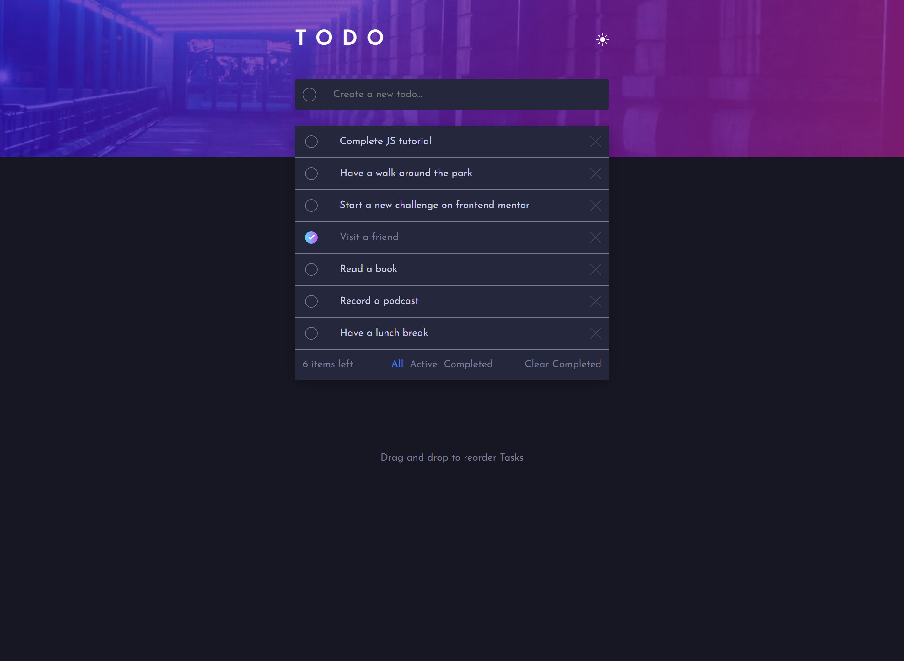
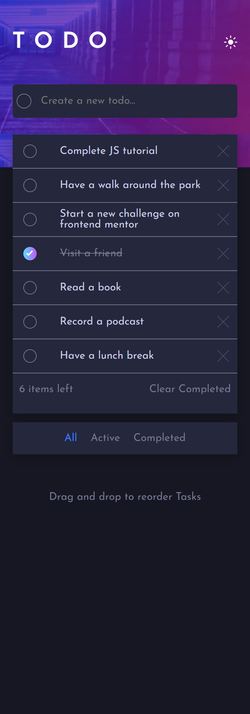

# Frontend Mentor - Todo app solution

This is a solution to the [Todo app challenge on Frontend Mentor](https://www.frontendmentor.io/challenges/todo-app-Su1_KokOW). Frontend Mentor challenges help you improve your coding skills by building realistic projects. 

## Table of contents

- [Overview](#overview)
  - [The challenge](#the-challenge)
  - [Screenshot](#screenshot)
  - [Links](#links)
- [My process](#my-process)
  - [Built with](#built-with)
  - [What I learned](#what-i-learned)
  - [Continued development](#continued-development)
- [Author](#author)
- [Acknowledgments](#acknowledgments)

## Overview

### The challenge

Users should be able to:

- View the optimal layout for the app depending on their device's screen size
- See hover states for all interactive elements on the page
- Add new todos to the list
- Mark todos as complete
- Delete todos from the list
- Filter by all/active/complete todos
- Clear all completed todos
- Toggle light and dark mode
- **Bonus**: Drag and drop to reorder items on the list

### Screenshot

### Links

- Solution URL: [https://www.frontendmentor.io/solutions/vue-and-vuex-DmEFxcDsEg](https://www.frontendmentor.io/solutions/vue-and-vuex-DmEFxcDsEg)
- Live Site URL: [https://tudu-lista.netlify.app/](https://tudu-lista.netlify.app/)

## My process

### Built with

- Semantic HTML5 markup
- CSS custom properties
- Flexbox
- CSS Grid
- Mobile-first workflow
- [Vue](https://vuejs.org/) - JS library
- [Vuex](https://nextjs.org/) - State Management framework

### What I learned

- Every process in the challenge made me learn. 
- Especially state management, drag and drop with vue draggable and theme switching

### Continued development

- Use local storage to store todo so that the data can persistent on the user's device

## Author

- Website - [Oluwakemi Omoyeni](https://captressketh.netlify.app)
- Frontend Mentor - [@Captressketh001](https://www.frontendmentor.io/profile/@Captressketh001)
- Twitter - [@cap_keth](https://www.twitter.com/cap_keth)

## Acknowledgments

- I will love to appreciate one of my colleagues, Taiwo Adetayo.

